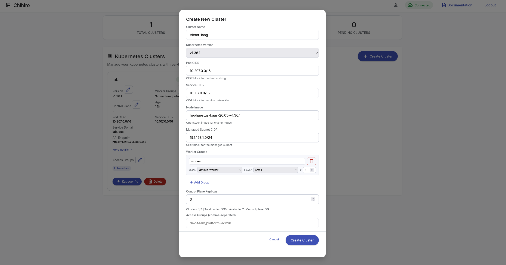

# AGENTS.md

Guidance for AI agents and contributors working in this repository.

## Golden rules

- **NEVER commit without explicit user confirmation.** Do not run `git commit`,
  `git push`, `git tag`, or any history-rewriting command unless the user has
  clearly asked for it in that turn. Staging for review is fine; committing is
  not. When work is ready, summarize the changes and ask before committing.
- Never introduce or hardcode secrets (client secrets, session keys, passwords,
  tokens). Secrets come from environment variables only.
- Match the existing commit style (gitmoji): e.g. `feat ✨:`, `fix 🐛 (scope):`,
  `refactor 🎨:`.

## Project overview

Chihiro is a Go web application that watches Kubernetes Cluster API (CAPI)
custom resources and exposes a dashboard to create, edit, and delete workload
clusters. More details on Chihiro's forms can be found here: https://banh-canh.github.io/posts/chihiro-forms/
Auth is OIDC; sessions are stored in Redis; the UI updates in real
time over WebSockets.




Module path: `github.com/Bealvio/chihiro`.

- Entry point: `main.go` -> `cmd/` (Cobra commands: `serve`, `debug`).
- HTTP server, routes, handlers: `internal/server/`.
- OIDC auth + session middleware: `internal/auth/`.
- Per-IP rate limiting: `internal/middleware/`.
- Cluster CRUD against CAPI: `internal/cluster/`.
- CAPI GVR discovery/resolution: `internal/capi/`.
- Cluster watch + WebSocket fan-out + per-user filtering: `internal/watcher/`.
- Kubeconfig generation (OIDC exec plugin): `internal/kubeconfig/`.
- Config: `config.yaml` (all keys overridable via `CHIHIRO_*` env vars).
- Frontend assets/templates: `web/` (`static/`, `templates/`).
- Branding images (logo, favicon): `assets/`.
- Kubernetes deployment manifests (kustomize): `manifests/`.
- Nix build definitions (binaries, OCI image): `nix/`.

## Tech stack

Go 1.26, Gin, spf13/cobra + viper, go-oidc/v3, gorilla/sessions + websocket,
boj/redistore, redis/go-redis/v9, k8s.io/client-go (dynamic/unstructured).

## Build / test / verify

Run these before proposing changes are done:

```sh
go build ./...        # must succeed
go vet ./...          # must be clean
go test ./...         # must pass (tests live in internal/cluster, internal/kubeconfig, internal/capi)
gofmt -l .            # must print nothing (format before finishing)
```

CI also enforces:
- `gofumpt -d .` — stricter gofmt formatting (must produce no diff).
- `golines --max-len=160 . --dry-run` — max line length 160 chars.

Install both with `go install mvdan.cc/gofumpt@latest` and
`go install github.com/segmentio/golines@latest`.

## Conventions

- Structured logging via `log/slog` only. Do not use `fmt.Print*` or the
  standard `log` package for runtime logging.
- Never log secrets. Log usernames/groups/cluster names, not tokens or
  client secrets.
- Return generic error strings to clients (e.g. `"authentication failed"`);
  keep detailed errors in `slog.Error`. Preserve this pattern.
- Config access: prefer the `getEnvOrConfig*` helpers in `cmd/serve.go` and
  `viper.Get*`; env vars use the `CHIHIRO_` prefix.
- `allowed_origins` (config key `allowed_origins`, env `CHIHIRO_ALLOWED_ORIGINS`)
  is a comma-separated list of full origin URLs trusted for OAuth redirect host
  detection and WebSocket origin checks. It is validated by exact string match
  (no substring matching). Only add entries that are genuinely trusted external
  origins; never use wildcards.
- Kubernetes objects are `unstructured` maps — guard every type assertion with
  the comma-ok form (the codebase does this consistently; keep it).
- Authorization is enforced per handler (see `internal/server/handlers.go`):
  `RequireAuth` -> access check via `watcher.GetClustersForUser(user.Groups)` ->
  `canUserModifyCluster` -> per-field `fieldEditable` (the latter two live in
  `internal/server/server.go`). Any new mutating endpoint MUST replicate this
  chain. Do not trust client-supplied namespaces or groups without checks.

## Security notes (current state — review before changing)

Things that are correct and must not regress:
- OAuth `state` is random (crypto/rand), stored in session, verified, and
  expires after 5 minutes; session ID is regenerated after login (fixation
  defense).
- Session cookies are `HttpOnly` + `SameSite=Lax`; HSTS set only under TLS.
- Security headers (CSP, X-Frame-Options DENY, nosniff) applied globally.
- Request body capped at 1MB; auth/API endpoints rate-limited per IP.
- WebSocket `CheckOrigin` rejects empty/unknown origins.
- Generated kubeconfigs intentionally omit the OIDC client secret — do not add
  it back into kubeconfig output. The cluster CA certificate (a public cert, not
  a secret) IS embedded as certificate-authority-data, retrieved from the CAPI
  `<cluster>-ca` (tls.crt/ca.crt), `<cluster>-kubeconfig`, or Kamaji
  `<cluster>-admin-kubeconfig` secrets (tried in order, under both the Cluster
  and control-plane base names). Keep this multi-source lookup. If the CA cannot
  be retrieved from any source, kubeconfig generation MUST fail loudly
  (`getClusterCAData` returns an error and `GenerateKubeconfig` propagates it) —
  chihiro never emits a kubeconfig without certificate-authority-data, so a
  transient or RBAC failure cannot silently downgrade TLS verification to the
  exec plugin / host trust store. Do not reintroduce silent omission.
- Cluster names validated against a strict regex before creation.
- Per-IP rate limiter entries are evicted when idle: `Cleanup(maxAge)` removes
  stale entries and `StartCleanup` runs it periodically (wired in
  `server.setupRoutes`, stopped via `Server.Close`). Do not reintroduce an
  unbounded limiter map.
- Session cookie `Secure` flag is config/TLS-driven (`CHIHIRO_SESSION_SECURE` /
  `session.secure`), auto-enabled when the OIDC redirect URL is HTTPS. Do not
  hardcode it back to `false`.
- WebSocket `CheckOrigin` (`checkWebSocketOrigin` in `internal/watcher`) uses
  exact host/origin matching, not substring matching. Keep it exact so values
  like `http://localhost:8080.evil.com` stay rejected.
- `allowed_origins` controls trusted external origins for both OAuth redirect
  host detection (`trustedRedirectHost` in `internal/auth`) and WebSocket
  origin checks. Entries are full origin URLs validated by exact string match.
  The configured OIDC `redirect_url` host is always implicitly trusted.
  Do not add wildcard entries.

## Efficiency notes

- `internal/cluster/manager.go` re-lists all CAPI clusters on each limit
  validation and again in handlers. Acceptable at the configured small scale
  (max ~5 clusters) but avoid adding more redundant full-list calls in hot
  paths; reuse the watcher cache (`watcher.GetClusters`) where correctness
  allows.
- Kubeconfig generation polls for `controlPlaneEndpoint` up to 90s on a 3s
  interval — keep the bounded context; never make it unbounded.

## What NOT to do

- Do not commit or push without confirmation (see Golden rules).
- Do not create new files unless necessary; prefer editing existing ones.
- Do not weaken auth checks, CSP, cookie flags, or rate limits.
- Do not place secrets in `config.yaml`, code, logs, or kubeconfig output.
- Do not switch logging away from `slog`.

## CI / CD

Three GitHub Actions workflows under `.github/workflows/`:

- **linting.yaml** — runs on PRs. Installs `gofumpt` and `golines`, enforces
  zero diff from `gofumpt -d .` and max line length 160 via `golines --dry-run`.
- **nix-build.yaml** — runs on PRs and pushes. Builds binaries and OCI image
  via Nix (`nix/binaries.nix`, `nix/oci.nix`).
- **push.yaml** — triggered by tag pushes (`*.*.*`) and manual dispatch.
  Builds an OCI image with Nix, pushes to Docker Hub via `skopeo`. Also runs
  GoReleaser (`goreleaser.yaml`) to produce cross-platform tar.gz archives
  with ldflags injecting `cmd.version`.

Release artifacts are built with `CGO_ENABLED=0` for linux/amd64, arm64, arm.

## Dev environment

- `devenv.nix` provides Go, `golangci-lint`, and `air` (hot-reload) plus a
  local Redis on `127.0.0.1:6379`.
- Enter with `devenv shell` (or let direnv load `.envrc`).
- Run the server: `CHIHIRO_OIDC_CLIENT_SECRET=xxx CHIHIRO_SESSION_KEY=xxx go run . serve --config=config.yaml`.
